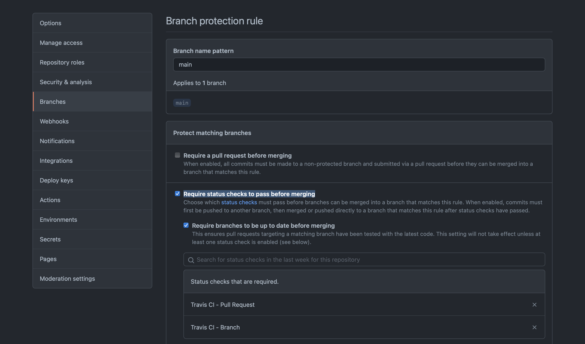

# CI/CD 환경 구축

1. Travis CI를 통한 지속적인 통합
2. Github Action을 통한 Docker Hub push
3. Github Action을 통한 서버 재시작  

## Travis CI

1. [Travis CI](https://www.travis-ci.com)에 깃허브 및 레포지토리 연동
2. [.travis.yml](./.travis.yml) 설정 파일 추가
3. Test 파일 추가
4. 깃허브 레포지토리 Settings/Branches/Branch protection rules에 브랜치명(main or master)에 Status Check 설정

5. 새로운 PR 생성 시 테스트 성공여부 확인

## Docker Hub push

1. 연결할 도커허브 아이디 및 패스워드 깃허브 레포지토리 Settings/Secrets에 추가 (ID: DOCKERHUB_USERNAME, PW: DOCKERHUB_TOKEN)
2. Github Action 등록 Actions -> set up a workflow yourself
3. [workflow 파일](./.github/workflows/docker-hub.yml) 등록

## Docker Run Image