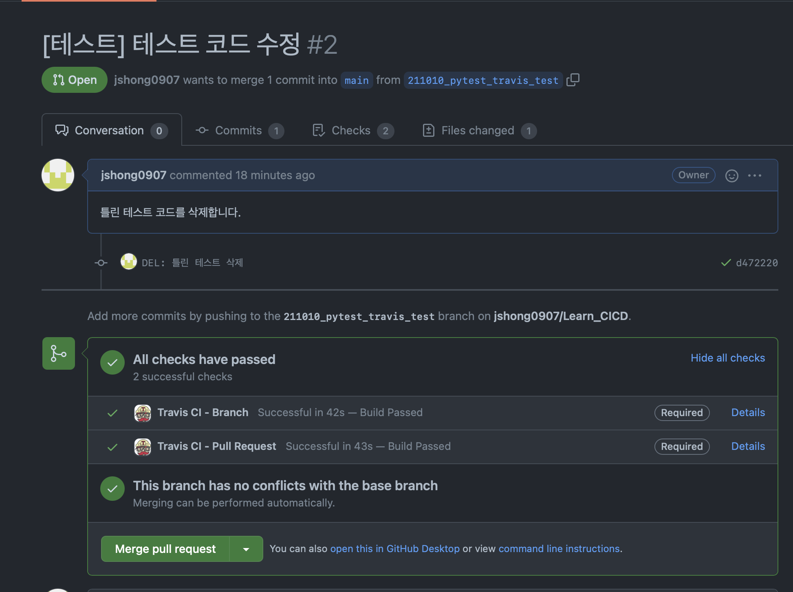

# CI/CD 환경 구축

1. Travis CI를 통한 지속적인 통합
2. Github Action을 통한 Docker Hub push
3. Github Action을 통한 서버 재시작  

## Travis CI
---
1. [Travis CI](https://www.travis-ci.com)에 깃허브 및 레포지토리 연동
2. [.travis.yml](./.travis.yml) 설정 파일 추가
3. Test 파일 추가
4. 깃허브 레포지토리 Settings/Branches/Branch protection rules에 브랜치명(main or master)에 Status Check 설정

5. 새로운 PR 생성 시 테스트 성공여부 확인

## Docker Hub push

